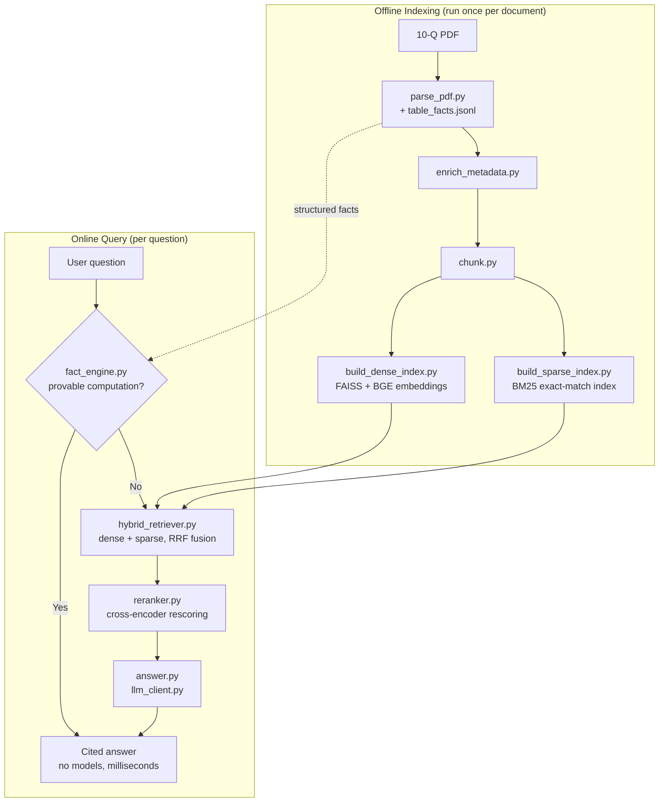

# Financial-Filing RAG

A Retrieval-Augmented Generation system for answering questions over SEC filings (10-Q/10-K). Combines dense + sparse retrieval, cross-encoder reranking, and a local LLM for grounded, cited answers — plus a deterministic fact engine that answers computation questions with no models at all. Test corpus: Apple Inc. Form 10-Q, Q3 2022.

## Architecture



## Pipeline Stages

| Stage | Script | Purpose |
|---|---|---|
| 1. Parsing | `parse_pdf.py` | Extracts narrative text and tables separately per page; reconstructs table header rows and captions; emits structured `table_facts.jsonl` |
| 2. Metadata enrichment | `enrich_metadata.py` | Tags fiscal period, section, and statement type |
| 3. Chunking | `chunk.py` | Splits text into overlapping chunks; one chunk per table |
| 4. Indexing | `build_dense_index.py`, `build_sparse_index.py` | Builds a FAISS dense index (BGE embeddings) and a BM25 sparse index |
| 5. Hybrid retrieval | `hybrid_retriever.py` | Fuses dense + sparse rankings via Reciprocal Rank Fusion |
| 6. Reranking | `reranker.py` | Rescores candidates with a cross-encoder |
| 7. Answer generation | `answer.py`, `llm_client.py`, `fact_engine.py` | Tries the deterministic fact engine first (sums, differences, % change, ratios); falls back to a grounded local-LLM prompt for everything else |

## Tech stack

| Layer | Tool |
|---|---|
| PDF parsing | pdfplumber (structure-aware tables) |
| Dense retrieval | sentence-transformers (`bge-large-en-v1.5`) + FAISS |
| Sparse retrieval | BM25 |
| Reranking | cross-encoder (`bge-reranker-v2-m3`) |
| Generation | Ollama `qwen3:4b` (local) |
| Computation | deterministic fact engine (stdlib only, no models) |

## Requirements

- Python 3.10+
- [Ollama](https://ollama.com) running locally with `qwen3:4b` pulled

```bash
python3 -m venv venv && source venv/bin/activate
pip install -r requirements.txt
ollama pull qwen3:4b
```

## Usage

```bash
# Ask questions (works immediately -- data/ artifacts are committed)
python3 main.py
```

```bash
# Reproduce the pipeline from scratch (optional)
python3 src/ingest/parse_pdf.py docs/2022_Q3_AAPL.pdf data/parsed_document.json
python3 src/ingest/enrich_metadata.py data/parsed_document.json data/parsed_document.enriched.json
python3 src/ingest/chunk.py data/parsed_document.enriched.json data/chunks.jsonl
python3 src/index/build_dense_index.py data/chunks.jsonl data/index
python3 src/index/build_sparse_index.py data/chunks.jsonl data/index
```

## Project Structure

```
main.py
src/
├── ingest/
│   ├── parse_pdf.py
│   ├── enrich_metadata.py
│   └── chunk.py
├── index/
│   ├── build_dense_index.py
│   └── build_sparse_index.py
├── retrieve/
│   ├── hybrid_retriever.py
│   └── reranker.py
└── generate/
    ├── answer.py
    ├── llm_client.py
    ├── fact_engine.py
    └── answer_integration.py
eval/
├── qa_testset.json
├── step1_retrieve.py
├── step2_generate.py
├── run_eval.py
└── scoring.py
data/   # pipeline artifacts (committed so the repo runs immediately)
docs/   # source filing
```

## Evaluation

14-question hand-built test set, two-step run (step1 exits fully before
step2 — the only reliable way to reclaim torch/faiss native memory on
8GB machines):

| Metric | Score |
|---|---|
| Retrieval hit rate | 14/14 (100%) |
| Mean MRR / NDCG@k | 0.875 / 0.912 |
| Answer correctness | 12/14 (86%) |
| Computation subset (fact engine) | 5/5 |

```bash
python3 eval/step1_retrieve.py eval/qa_testset.json data/index
python3 eval/step2_generate.py eval/prepared.json qwen3:4b
```

The 2 failures were LLM timeouts during the batch run (no answer
produced, not wrong answers); both answer correctly on re-run
through main.py, a batch latency-robustness note, not a
retrieval or answer-quality failure.

## Known Limitations

- No figure extraction needed: verified programmatically (28-page scan —
  0 figures; the single 46×56px image on page 1 is a thumbnail artifact)
- Single-document corpus; not yet tested at multi-document scale
- Tested on an 8GB machine via the two-step eval split above
