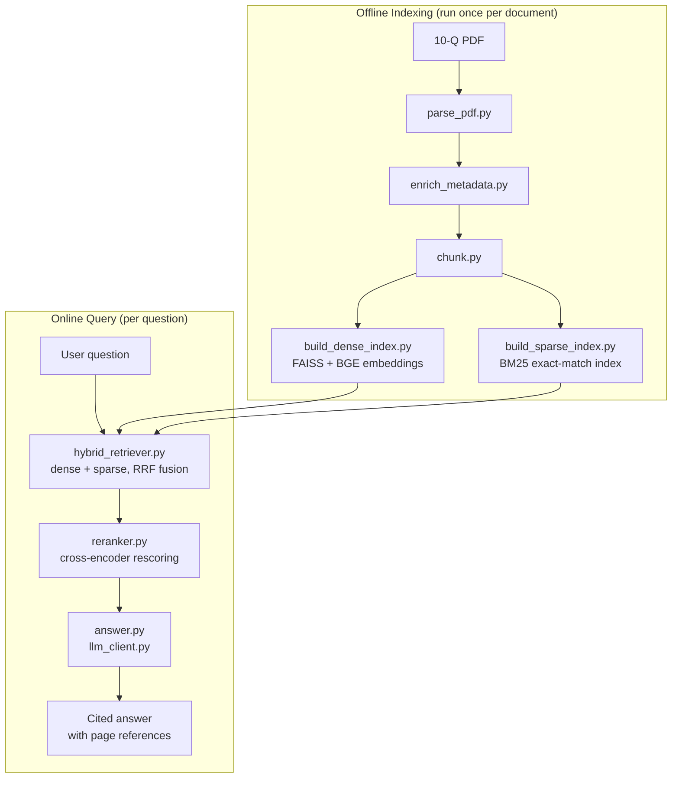

# Financial-Filing RAG

A Retrieval-Augmented Generation system for answering questions over SEC filings (10-Q/10-K). Combines dense + sparse retrieval, cross-encoder reranking, and a local LLM for grounded, cited answers. Test corpus: Apple Inc. Form 10-Q, Q3 2022.

## Architecture



## Pipeline Stages

| Stage | Script | Purpose |
|---|---|---|
| 1. Parsing | `parse_pdf.py` | Extracts narrative text and tables separately per page; reconstructs table header rows and captions |
| 2. Metadata enrichment | `enrich_metadata.py` | Tags fiscal period, section, and statement type |
| 3. Chunking | `chunk.py` | Splits text into overlapping chunks; one chunk per table |
| 4. Indexing | `build_dense_index.py`, `build_sparse_index.py` | Builds a FAISS dense index (BGE embeddings) and a BM25 sparse index |
| 5. Hybrid retrieval | `hybrid_retriever.py` | Fuses dense + sparse rankings via Reciprocal Rank Fusion |
| 6. Reranking | `reranker.py` | Rescores candidates with a cross-encoder |
| 7. Answer generation | `answer.py`, `llm_client.py` | Builds a grounded prompt and queries a local LLM (Ollama) for a cited answer |

## Requirements

- Python 3.10+
- [Ollama](https://ollama.com) running locally with `qwen3:4b` pulled

```bash
pip install -r requirements.txt
ollama pull qwen3:4b
```

## Usage

```bash
# 1. Parse and prepare the document
python3 src/parse/parse_pdf.py data/10Q.pdf data/parsed_document.json
python3 src/parse/enrich_metadata.py data/parsed_document.json data/parsed_document.enriched.json
python3 src/index/chunk.py data/parsed_document.enriched.json data/chunks.jsonl

# 2. Build indexes
python3 src/index/build_dense_index.py data/chunks.jsonl data/index
python3 src/index/build_sparse_index.py data/chunks.jsonl data/index

# 3. Ask a question
python3 src/generate/answer.py data/index "What were total net sales for Q3 2022?"
```

## Project Structure

```
src/
├── parse/
│   ├── parse_pdf.py
│   └── enrich_metadata.py
├── index/
│   ├── chunk.py
│   ├── build_dense_index.py
│   └── build_sparse_index.py
├── retrieve/
│   ├── hybrid_retriever.py
│   └── reranker.py
└── generate/
    ├── answer.py
    └── llm_client.py
eval/
├── qa_testset.json
├── step1_retrieve.py
└── step2_generate.py
```

## Evaluation

9-question test set, run end-to-end:

| Metric | Score |
|---|---|
| Retrieval hit rate | 9/9 (100%) |
| Mean MRR | 0.870 |
| Mean NDCG@k | 1.062 |
| Generation keyword-match rate | 9/9 (100%) |
| Mean token F1 | 0.681 |

```bash
python3 eval/step1_retrieve.py eval/qa_testset.json data/index
python3 eval/step2_generate.py eval/prepared.json qwen3:4b
```

## Known Limitations

- No figure/image extraction (text and tables only)
- Single-document corpus; not yet tested at multi-document scale
- Requires ~4GB free RAM for embedding + reranker + LLM to run concurrently
